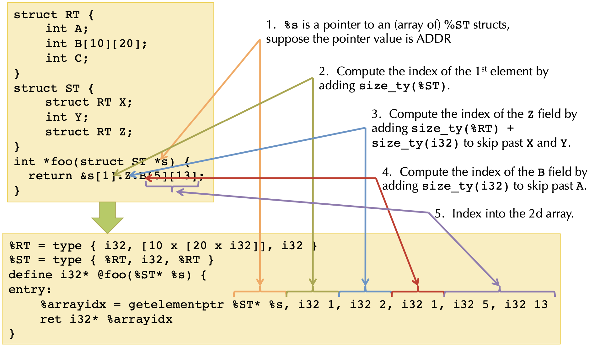

# Rust LLVM "hello, world!"

## Create

创建过程：

1. 创建一个 Module
2. 在 Module 中添加 Function
3. 在 Function 中添加 BasicBlock
4. 在 BasicBlock 中添加指令
5. 创建一个 ExecutionEngine
6. 使用 ExecutionEngine 来运行 IR

## Concepts

**Module**，可以将 LLVM 中的 Module 类比为 C 程序中的源文件。一个 C 源文件中包含函数和全局变量定义、外部函数和外部函数声明，一个 Module 中包含的内容也基本上如此，只不过C源文件中是源码来表示，Module 中是用 IR 来表示。

**Function**，Function 是 LLVM JIT 操作的基本单位。Function 被 Module 所包含。LLVM 的 Function 包含函数名、函数的返回值和参数类型。Function 内部则包含 BasicBlock。

**BasicBlock**，BasicBlock与编译技术中常见的基本块 (basic block) 的概念是一致的。BasicBlock 必须以跳转指令结尾。

**Instruction**，Instruction就是 LLVM IR 的最基本单位。Instruction 被包含在 **BasicBlock 中。

**ExecutionEngine**，ExecutionEngine 是用来运行 IR 的。运行IR有两种方式：解释运行和 JIT 生成机器码运行。相应的 ExecutionEngine 就有两种：Interpreter 和 JIT。ExecutionEngine 的类型可以在创建 ExecutionEngine 时指定。

## Convert


### Struct



In C code:

```c
struct RT {
    int A;
    int B[10][20];
    int C;
}
struct ST {
    struct RT X;
    int Y;
    struct RT Z;
}
int *foo(struct ST *s) {
    return &s[1].Z.B[5][13];
}
```

In LLVM code:

```ll
%RT = type { i32, [10 x [20 x i32]], i32 }
%ST = type { %RT, i32, %RT }
define i32* @foo(%ST* %s) {
entry:
    %arrayidx = getelementptr %ST* %s, i32 1, i32 2, i32 1, i32 5, i32 13
    ret i32* %arrayidx
}
```

参考文章：

 - 《[使用LLVM IR编程](http://richardustc.github.io/2013-06-19-2013-06-19-programming-with-llvm-ir.html)》
